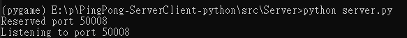
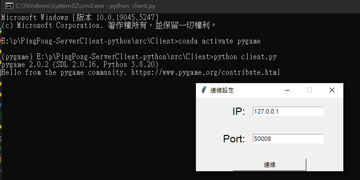

# PingPong-ServerClient-python

## 簡介
這是一個乒乓球連線對打遊戲

## DEMO

[Youtube](https://youtu.be/BwyoY-ANjBw)

## 使用說明

- 安裝所需套件
    ```bash
    cd ./src/Server

    pip install -r requirements.txt
    ```

- 啟動Server
    ```bash
    cd ./src/Server
    python server.py
    ```
    
- 執行Client
    ```bash
    cd ./src/Client
    python client.py
    ```
    